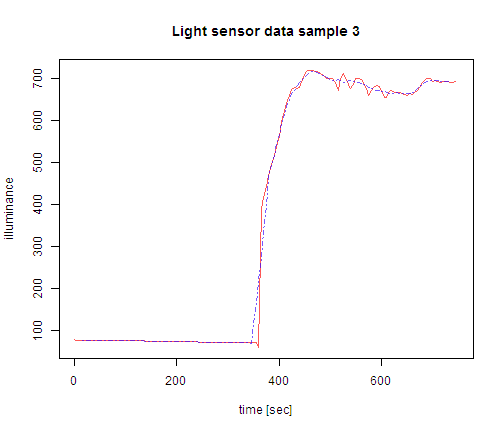

####Using R to visualize the light sensor data as time series - capturedData_3.csv


This R script creates a plot from data captured by the light sensor over a period of 13 minutes or so. The first part (about first half) is result of ambient light in a room, slightly decreasing over time. Then the sensor was moved under a fluorescent office lamp and the lamp was turned on. At taht time the sensor has been exposed to combination of ambient light and light from the lamp.

First we navigate to the data folder and load the CSV file:


```r
folder = "C:/opt/GitHub/SCR/light-sensor-msp430-simple/data"
setwd(folder)
dataset = read.csv("capturedData_3.csv", header = T)
```


Let's take a look at the data set:


```r
head(dataset, 10)  # the first 10 samples
```

```
##    Ndis ApproxLux
## 1  2284     78.58
## 2  2291     78.11
## 3  2293     77.98
## 4  2289     78.25
## 5  2295     77.85
## 6  2299     77.58
## 7  2299     77.58
## 8  2304     77.26
## 9  2305     77.19
## 10 2304     77.26
```


The following command takes the second column and converts it to time series:


```r
light.ts = ts(dataset[, 2], start = 0, deltat = 5)
```


The series can be smoothed if desired - here we apply simple moving average:


```r
light.ts.f1 = filter(light.ts, filter = rep(1/7, 7))
```


The next commands plot the original (red) and the smoothed series (blue):


```r
plot(light.ts, type = "l", xlab = "time [sec]", ylab = "illuminance", main = "Light sensor data sample 3", 
    col = hsv(0, 1, 1, 0.66))
lines(light.ts.f1, type = "l", lty = 4, col = hsv(0.7, 1, 1, 0.66))
```

 


